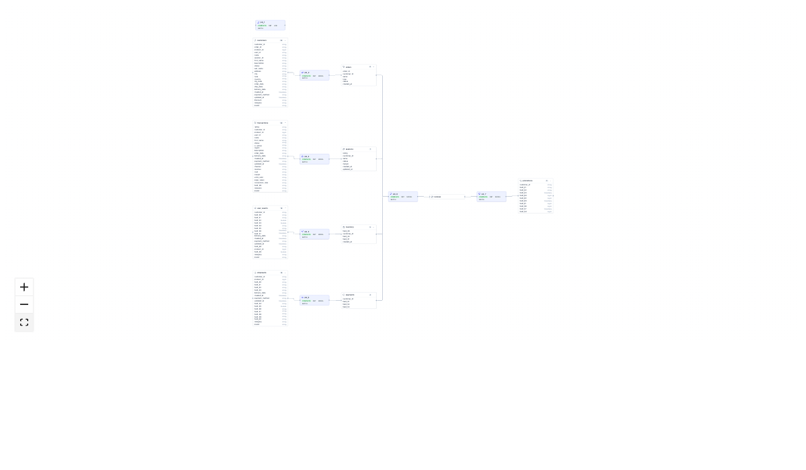

# OpenLineage Visualizer

Visualizes OpenLineage events as a lineage graph using React Flow.



Supports OpenLineage events as JSON array or NDJSON.

## Setup

```bash
npm install
```

## Development

```bash
npm run dev
```

Open http://localhost:5173.

The app reads data from the URL in the `data-json-url` attribute on the `#openlineage-visualizer` div in `index.html`.

### Using test events

Test events are included at `public/test-events.json`. By default `index.html` points to them:

```html
<div id="openlineage-visualizer" data-json-url="/test-events.json" data-height="500px"></div>
```

## Expected data formats

The visualizer accepts two formats via the `data-json-url` endpoint:

### 1. OpenLineage events (JSON array)

```json
[
  {
    "eventType": "COMPLETE",
    "eventTime": "2025-01-01T12:00:00Z",
    "run": { "runId": "abc-123" },
    "job": {
      "namespace": "my_scheduler",
      "name": "etl_job",
      "facets": {
        "jobType": { "integration": "SPARK", "jobType": "TASK", "processingType": "BATCH" },
        "sql": { "query": "INSERT INTO output_table SELECT id, name FROM input_table" }
      }
    },
    "inputs": [
      {
        "namespace": "postgres://db:5432",
        "name": "public.input_table",
        "facets": {
          "schema": {
            "fields": [
              { "name": "id", "type": "INTEGER", "description": "Primary key" },
              { "name": "name", "type": "VARCHAR" }
            ]
          }
        }
      }
    ],
    "outputs": [
      {
        "namespace": "postgres://db:5432",
        "name": "public.output_table",
        "facets": {
          "schema": {
            "fields": [
              { "name": "id", "type": "INTEGER" },
              { "name": "name", "type": "VARCHAR" }
            ]
          },
          "columnLineage": {
            "fields": {
              "id": {
                "inputFields": [
                  { "namespace": "postgres://db:5432", "name": "public.input_table", "field": "id" }
                ]
              }
            }
          }
        }
      }
    ]
  }
]
```

### 2. NDJSON (one event per line)

Same event structure as above, one JSON object per line.


## Build

```bash
npm run build
```

Output goes to `dist/`.
